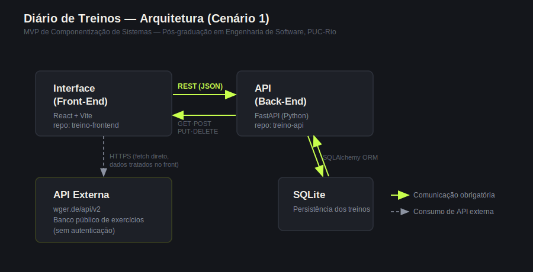

# Diário de Treinos — Interface (Front-End)

Interface web para montar e registrar treinos de academia e acompanhar a
evolução: carga por exercício, volume semanal e equilíbrio entre grupos
musculares.

Este repositório é o componente **Interface (Front-End)** do MVP de
Componentização de Sistemas (pós-graduação em Engenharia de Software,
PUC-Rio), no **Cenário 1**: Interface (Front-End) ↔ API (Back-End) ↔
SQLite, com a Interface consumindo também uma API externa de exercícios.

Repositório irmão (Back-End): `treino-api`.

## Arquitetura



A Interface, em **React (Vite)**, conversa com:

1. A **API própria** (`treino-api`, FastAPI + SQLite): criar, listar, editar e
   excluir treinos, além das consultas de resumo semanal e evolução.
2. A **API externa wger**: busca de exercícios para montar o treino.

## Problema que resolve

Um caderno ou planilha de treino guarda os números, mas não mostra se você
está progredindo. O app responde:

- **Estou evoluindo?** Gráfico de carga máxima por exercício ao longo do tempo.
- **Estou equilibrado?** Média de séries por semana em cada grupo muscular,
  deixando visíveis os grupos esquecidos.
- **Estou sendo consistente?** Treinos por semana e volume semanal.

## Funcionalidades

- **Painel**: estatísticas da semana, gráfico de evolução por exercício,
  volume semanal, equilíbrio muscular e histórico de treinos expansível
- **Montar treino**: nome, data, observações e lista dinâmica de exercícios
  (adicionar, remover, reordenar), com totais de séries e volume em tempo real
  e autocompletar com exercícios já usados
- **Repetir treino**: copia um treino anterior para hoje, só ajustando as cargas
- **Banco de exercícios**: busca na API wger por grupo muscular ou nome e
  adiciona direto ao treino em montagem
- **Treino em montagem persistente**: o rascunho é mantido ao navegar entre
  as telas e ao recarregar a página (localStorage), permitindo registrar
  durante o treino pelo celular
- Layout responsivo (desktop e celular)

## API Externa utilizada: wger

- **Serviço**: [wger](https://wger.de), plataforma open source de treinos com banco público de exercícios.
- **Documentação**: https://wger.readthedocs.io/en/latest/api/api.html
- **Licença**: software livre (AGPL-3.0); os endpoints públicos de exercícios são de acesso livre.
- **Cadastro/autenticação**: não é necessário para as rotas usadas (somente leitura de dados públicos).
- **Rotas utilizadas**:
  - `GET https://wger.de/api/v2/exerciseinfo/?category={id}&language=2&format=json`: exercícios de um grupo muscular, com nome, imagem, equipamento e categoria.
  - `GET https://wger.de/api/v2/exercise/search/?term={termo}&language=english&format=json`: busca por nome.
- **Tratamento dos dados**: em `src/api/wgerApi.js` os resultados são normalizados (nome, imagem, equipamento) e a categoria da wger é convertida para o grupo muscular da aplicação. Tudo é exibido dentro da própria interface; o usuário nunca é redirecionado para a wger.

## Tecnologias

- React 19 + Vite
- React Router
- Recharts (gráficos)
- CSS próprio (sem framework de UI)
- Nginx (serve o build no container)
- Docker

## Instalação e execução local (sem Docker)

Pré-requisito: **Node.js 20.19+ ou 22+** (o Vite 8 não roda em versões anteriores).

```bash
git clone (https://github.com/Gumeyohas/diario-treinos-frontend.git)
cd treino-frontend
npm install
cp .env.example .env     # ajuste VITE_API_URL se a API não estiver em localhost:8000
npm run dev
```

Acesse `http://localhost:5173`. A API (`treino-api`) precisa estar rodando.

## Execução com Docker

```bash
docker build -t treino-frontend --build-arg VITE_API_URL=http://localhost:8000 .
docker run -p 5173:80 treino-frontend
```

Acesse `http://localhost:5173`.

## Estrutura do projeto

```
treino-frontend/
├── src/
│   ├── main.jsx                   # Entrada: router, provider do rascunho e estilos
│   ├── App.jsx                    # Layout e rotas
│   ├── api/
│   │   ├── treinosApi.js          # Cliente da API própria
│   │   └── wgerApi.js             # Cliente da API externa wger
│   ├── context/
│   │   └── RascunhoContext.jsx    # Treino em montagem (compartilhado entre telas)
│   ├── components/
│   │   ├── Sidebar.jsx
│   │   ├── TreinoCard.jsx         # Treino expansível do histórico
│   │   ├── EvolucaoChart.jsx      # Carga máxima por exercício
│   │   ├── VolumeChart.jsx        # Volume por semana
│   │   ├── EquilibrioChart.jsx    # Séries por grupo muscular
│   │   └── chartTheme.js
│   ├── pages/
│   │   ├── Dashboard.jsx
│   │   ├── FormTreino.jsx         # Montar / editar treino
│   │   └── BuscarExercicios.jsx   # Banco de exercícios (wger)
│   ├── utils/
│   │   └── datas.js
│   └── styles/
│       ├── global.css
│       ├── layout.css
│       └── components.css
├── docs/
│   └── arquitetura.png
├── Dockerfile
├── nginx.conf
└── README.md
```
